# Sistema Hospitalario — Módulo 5: Historia Clínica

Presentación para el docente. Evaluación N° 01 del curso Desarrollo de Aplicaciones Web (Semana 4).

**Integrantes:**
- Renzo León — RF-HC-05, RF-HC-06, RF-HC-07
- Lucas Inga — RF-HC-01, RF-HC-02, RF-HC-03

---

## 1. Objetivo del módulo

El módulo permite crear, consultar y gestionar la historia clínica del paciente, registrando sus datos básicos, antecedentes personales, antecedentes familiares y alergias.

```
PACIENTE → HISTORIA CLINICA → Antecedentes personales
                             → Antecedentes familiares
                             → Alergias
```

## 2. Tecnologías

Spring Boot · Spring Data JPA (Hibernate) · MariaDB · Thymeleaf · Bootstrap · Postman

Arquitectura por capas: Entidad → Repository → Service → Controller.

## 3. Relaciones entre entidades

- `Paciente` 1 — 1 `HistoriaClinica` (`@OneToOne`)
- `HistoriaClinica` 1 — N `Antecedente`, `AntecedenteFamiliar` y `Alergia` (`@ManyToOne` desde cada una hacia la historia)

Antes de esta entrega, `AntecedenteFamiliar` guardaba el número de historia como un dato suelto sin relación real; ahora las tres entidades dependen de una historia clínica que debe existir (si no existe, el sistema no permite guardar el registro).

---

## 4. RF-HC-01 — Generar un número único de historia clínica

**Responsable:** Lucas Inga

Al elegir un paciente y generar su historia, el sistema arma el número automáticamente combinando el ID del paciente con la marca de tiempo (por ejemplo `HC-000001-8326`), garantizando que nunca se repita.

**Captura — formulario para generar la historia (elige el paciente):**

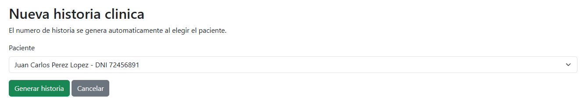

**Captura — listado con el número único ya generado:**

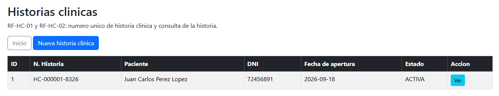

---

## 5. RF-HC-02 — Consultar la historia clínica de un paciente

**Responsable:** Lucas Inga

Desde el listado de historias se accede a la ficha completa de una historia clínica puntual, donde se puede revisar toda la información asociada a ella.

**Captura — ficha de consulta de la historia clínica:**

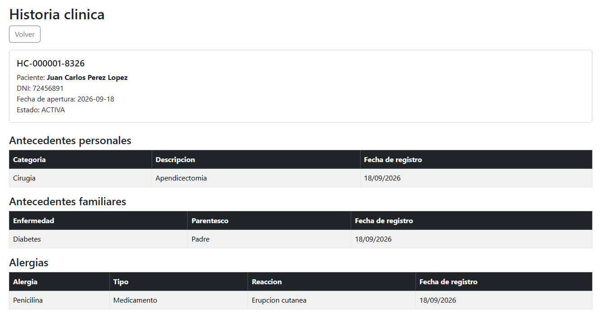

---

## 6. RF-HC-03 — Mostrar los datos básicos del paciente

**Responsable:** Lucas Inga

El listado de pacientes muestra sus datos básicos (ID, nombres, apellidos, DNI), y esos mismos datos aparecen dentro de la ficha de la historia clínica asociada.

**Captura — listado de pacientes:**

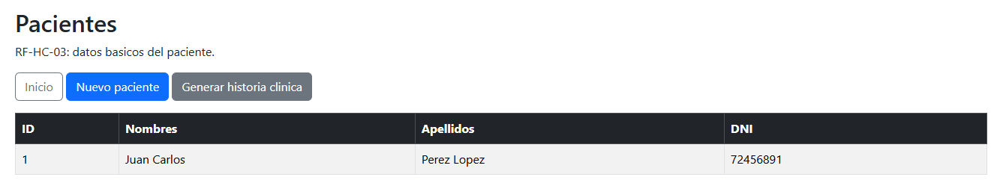

**Captura — datos del paciente dentro de la ficha de la historia:** (ver la misma imagen de la sección RF-HC-02, arriba)

---

## 7. RF-HC-05 — Registrar antecedentes personales

**Responsable:** Renzo León

Se registran enfermedades previas, cirugías, hospitalizaciones, enfermedades crónicas, traumatismos, transfusiones u otros antecedentes, siempre asociados a una historia clínica existente.

**Captura — formulario de registro:**

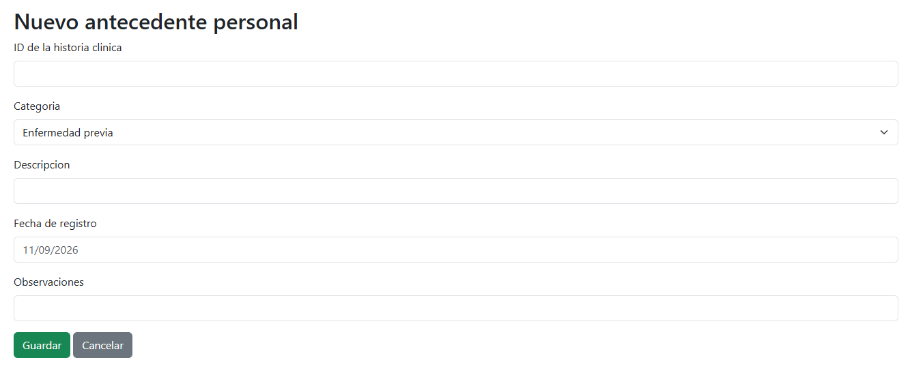

**Captura — listado con el registro guardado:**

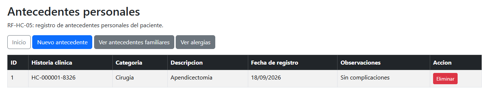

---

## 8. RF-HC-06 — Registrar antecedentes familiares

**Responsable:** Renzo León

Se registran enfermedades familiares (diabetes, hipertensión, enfermedad cardiovascular, cáncer, enfermedad hereditaria u otro) junto con el parentesco, asociadas a una historia clínica existente.

**Captura — formulario de registro:**

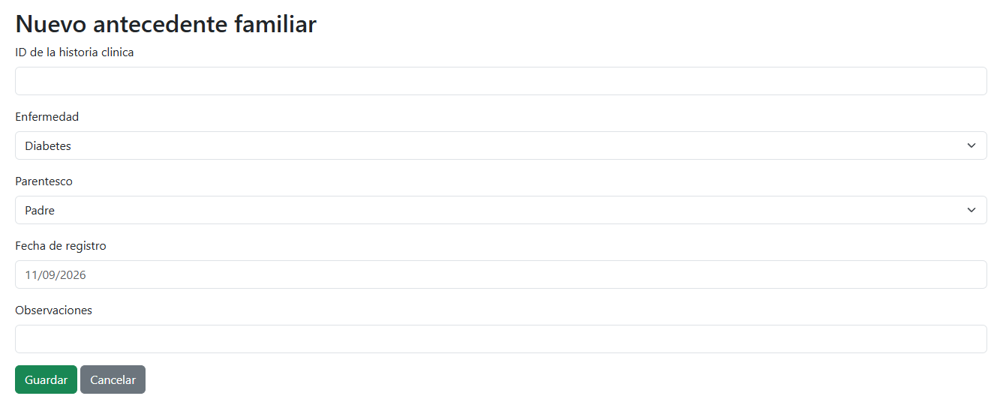

**Captura — listado con el registro guardado:**

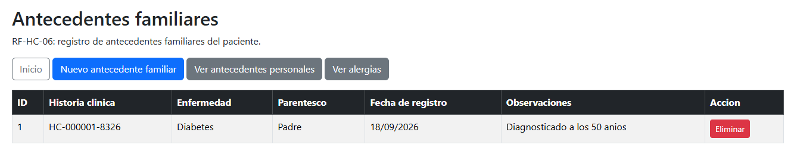

---

## 9. RF-HC-07 — Registrar alergias

**Responsable:** Renzo León

Se registra el nombre de la alergia, el tipo (medicamento, alimento, ambiental u otro), la reacción y las observaciones, asociadas a una historia clínica existente.

**Captura — formulario de registro:**

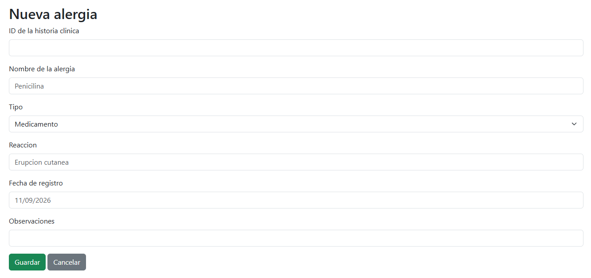

**Captura — listado con el registro guardado:**

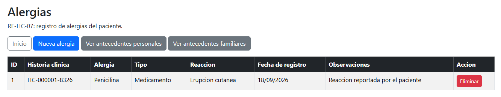

---

## 10. Cierre de la demostración

La captura más completa para cerrar la presentación es la ficha de la historia clínica (sección RF-HC-02/03), porque en una sola pantalla se ve al paciente y sus tres tipos de registros clínicos —antecedentes personales, familiares y alergias— todos relacionados a la misma historia clínica `HC-000001-8326`. Esa pantalla es la prueba visual de que las relaciones entre entidades funcionan de extremo a extremo.

**Panel de navegación del módulo completo:**

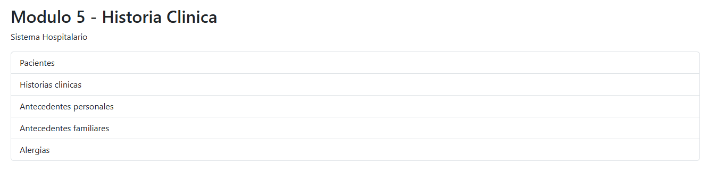

---

## 11. Pendiente para la entrega final

- Cambiar `ddl-auto` de `create-drop` a `update` en `application.properties`, para no perder los datos cada vez que se reinicia la aplicación.
- Probar todos los endpoints en Postman y documentar las capturas de esas pruebas.
- Que el equipo decida si unifica `AntecedenteFamiliar` con el catálogo `CondicionMedica` que también existe en el proyecto.

Detalle técnico completo en [README.md](README.md) y en [MODULO-5-HISTORIA-CLINICA.md](MODULO-5-HISTORIA-CLINICA.md). Descripción de cada captura en [capturas/CAPTURAS.md](capturas/CAPTURAS.md).
